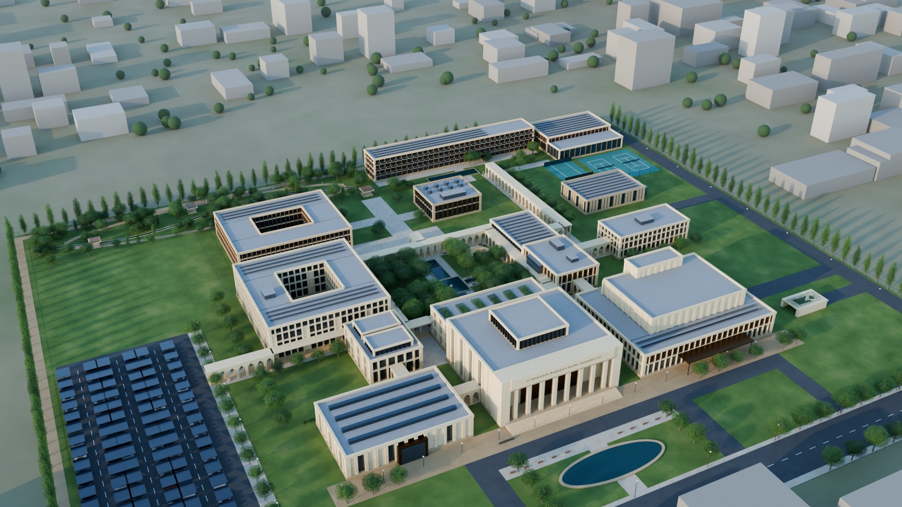
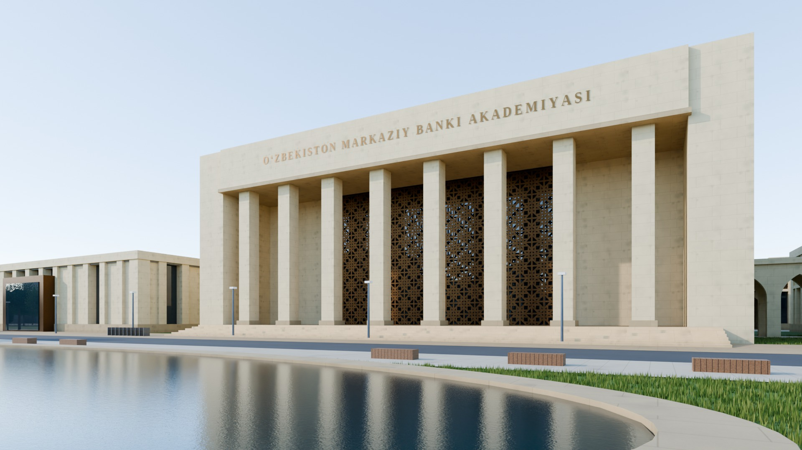
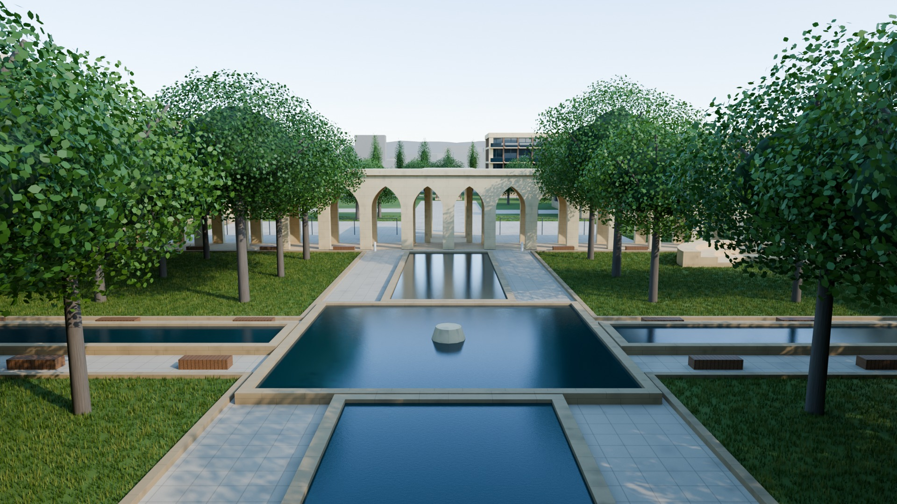
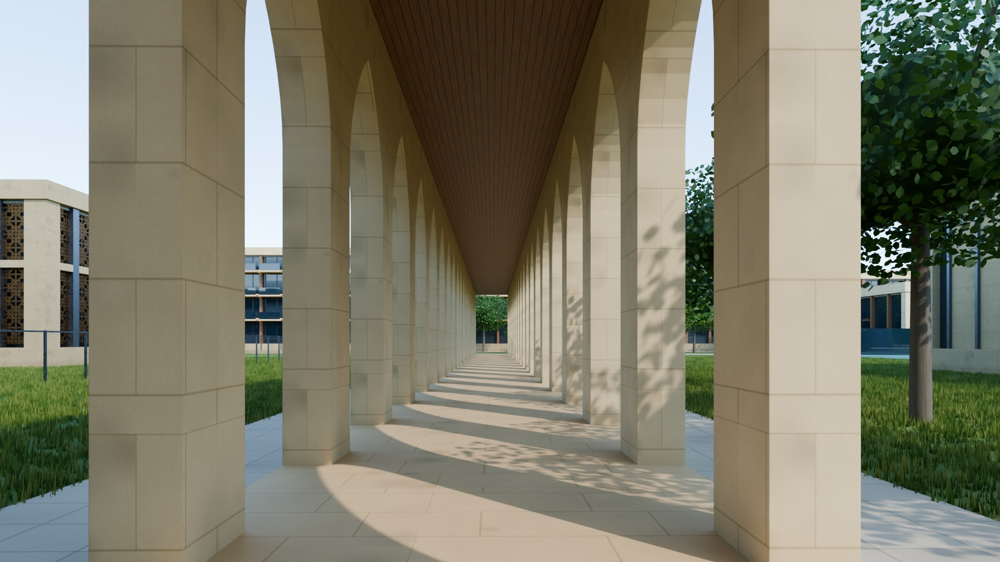
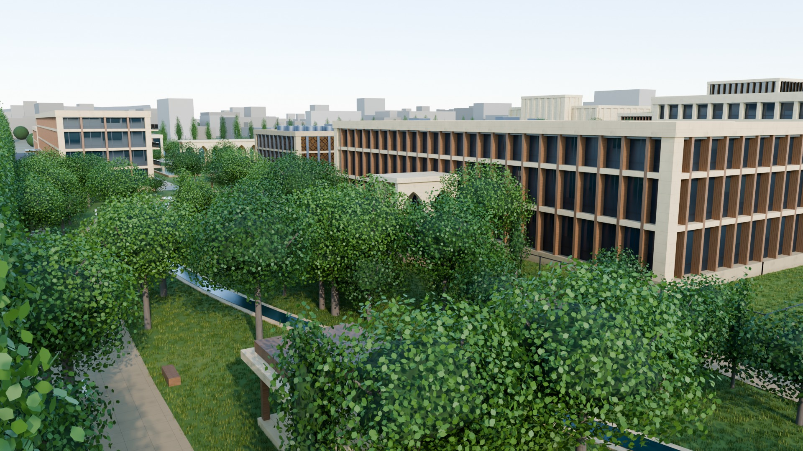
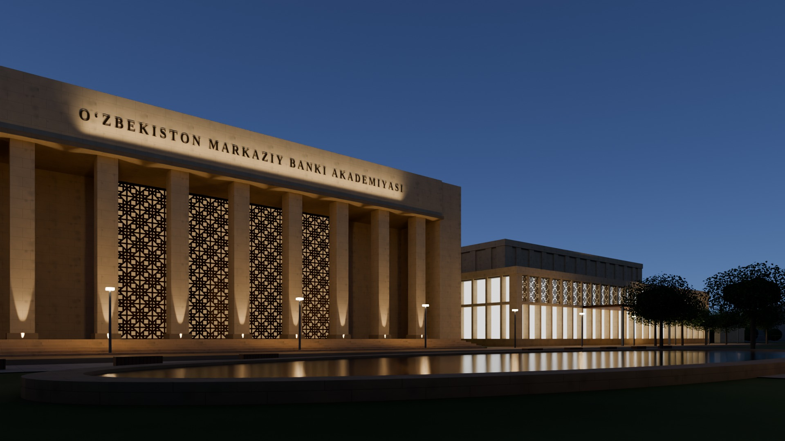

# O‘zbekiston Markaziy Banki Akademiyasi — 3D maket va simulyatsiya

Konsepsiya asosida qurilgan interaktiv 3D kampus maketi (B layout). Brauzerda ishlaydi, hech narsa o‘rnatish shart emas.

> **Bilim → Tahlil → Qaror**
> Konseptual maket. Aniq loyiha hujjati emas.

## Nimalar bor

| Bo‘lim | Tarkibi |
|---|---|
| **Ko‘rinish** | 15 zonali kampus maketi; 7 ta kamera nuqtasi; ~1,5 daqiqalik avtomatik tur (12 to‘xtash, izohlar bilan); piyoda rejim (W A S D); PNG rasm va GLB 3D model eksporti |
| **Quyosh** | Toshkent (41,3° sh.k.) uchun real quyosh holati, istalgan sana va soat. Hovli soyasi foizi taqqoslanadi: «faqat binolar» va «+ ravoq va chinorlar». Butun uchastka bo‘yicha kunlik quyosh soatlari xaritasi |
| **Xavfsizlik** | Ring 1 / 2 / 3 zonalari, binolarning ring rangi, Ring 3 to‘sig‘i, 9 ta nazorat nuqtasi |
| **Odamlar** | Ikki ssenariy: «Oddiy o‘quv kuni» (~550 kishi) va «Xalqaro konferensiya kuni» (~930 kishi). Har bir odam o‘z jadvali bo‘yicha va faqat ruxsat etilgan ring yo‘llaridan yuradi. Ko‘rsatkichlar: soyada yurish ulushi, o‘rtacha yurish masofasi, ring buzilishlari, binolar bandligi |
| **Interyer** | Grand Academy Hall (20 m atrium, girih panjara orqali tushadigan quyosh naqshi, Knowledge Stair, digital wall). MPC Simulation Room (oval stol, vizualizatsiya devori, pul-kredit siyosati o‘quv modeli: 6 xil shok, 12 chorak prognozi) |
| **Raqamlar** | Model maydonlari konsepsiyaning 24-bo‘lim maqsadlari bilan taqqoslanadi; konsepsiyaga kiritilgan 7 ta o‘zgartirishning har biri maketda ko‘rsatiladi |
| **Renderlar** | Blender (Cycles) da olingan 6 ta fotorealistik kadr galereyasi |

## Fotorealistik renderlar (Blender)

Maketning o‘zi Blender 5.2 (Cycles) da render qilingan. Tafsilotlar va qayta render qilish yo‘riqnomasi: [`render/README.md`](render/README.md).

| | |
|---|---|
|  |  |
| Kampus umumiy ko‘rinishi | Ceremonial Entrance va Grand Academy Hall |
|  |  |
| Academy Courtyard — chorbog‘ | Sharqiy ravoq — soyali promenada |
|  |  |
| Research Institute va Scholars’ Garden | Grand Academy Hall — oqshom |

## Konsepsiyaga kiritilgan o‘zgartirishlar (B layout)

1. **Conference Centre va Museum** Grand Hall’ning ikki yonida joylashgan. Ikkalasi Ring 1 da, alohida kirishlar bilan, shuning uchun bosh o‘q konferensiya oqimidan xoli.
2. **Knowledge Centre bosh o‘qda**, Grand Hall bilan hovli orasida. Knowledge Stair unga to‘g‘ridan-to‘g‘ri olib chiqadi.
3. **Secure Data Lab Ring 3 da**, Research Institute yonida. Ochiq laboratoriyalar Ring 2 da qolgan.
4. **Hovli uchun soya yechimi**: perimetr bo‘ylab ravoqlar va to‘rt bo‘lakda chinorlar. 21-iyun soat 13:00 da faqat binolar hovlining ~10% ini soyada qoldiradi, ravoq va chinorlar bilan bu ~50% ga yetadi.
5. **Yopiq ravoqlar tarmog‘i** (~500 m) barcha bloklarni bog‘laydi.
6. **Residence’ga alohida kirish** bor: mehmonlar shimoli-sharqdagi yo‘ldan keladi.
7. **Gibrid parking**: ~265 joy quyosh panelli soyabonlar ostida, ~150 joy yer ostida, ~30 joy xizmat zonasida.

## Asosiy raqamlar (model)

- Uchastka: 380 × 300 m = **11,4 ga**
- Umumiy qurilish maydoni: **~51 ming m²** (maqsad 45–55 ming m²)
- Barcha 7 toifa konsepsiya oralig‘ida: Academic 11,9k · Research 7,0k · Conference 5,6k · Data/AI/Simulation 4,7k · Knowledge + Museum 4,9k · Residence & Club 10,2k · Admin/Support 6,8k
- Hovli: 80 × 60 m (chorbog‘: xoch shaklidagi suv havzasi)
- Residence: ~140 xona

## Ishga tushirish

```bash
npm install
npm run dev          # http://localhost:5173
npm run build        # dist/ — istalgan statik hostingga qo‘yish mumkin
npm run typecheck
```

Qo‘shimcha skriptlar:

```bash
npm run build:artifact   # artifact/akademiya-3d.html — bitta fayldagi sahifa (claude.ai artifact uchun)
npx vite preview --port 4173 &
npm run export:glb       # exports/akademiya-kampus.glb
node scripts/screenshots.mjs http://localhost:5173/ shots   # headless skrinshotlar
```

## 3D model arxitektorlar uchun

`exports/akademiya-kampus.glb` — glTF 2.0 (binar), birlik metr, Y yuqoriga, −Z shimolga qaragan. Blender, Twinmotion, Lumion, SketchUp yoki Revit’ga import qilib, fotorealistik render qilish mumkin. Daraxtlar va panellar `EXT_mesh_gpu_instancing` bilan saqlangan.

## Konsepsiyani o‘zgartirish

Barcha binolar, o‘lchamlar, ringlar va kartadagi matnlar **`src/data/campus.ts`** faylida turadi. Binoning `rect`, `floors` yoki `floorH` qiymatini o‘zgartirsangiz, maket, maydon jadvali va kartalar avtomatik yangilanadi.

Koordinatalar: uchastka markazi (0, 0), `x` sharqqa, `z` janubga (Ceremonial Entrance janubda).

## Tuzilma

```
src/
  data/campus.ts        konsepsiya ma’lumotlari (binolar, zonalar, maqsad maydonlar)
  core/                 quyosh algoritmi, materiallar, muhit, soya to‘siqlari
  scene/                binolar generatori, ravoqlar, landshaft
  sim/                  soya tahlili, navigatsiya grafi, odamlar simulyatsiyasi
  interiors/            Grand Hall, MPC xonasi, pul-kredit siyosati modeli
  features/             UI bo‘limlari (ko‘rinish, quyosh, xavfsizlik, odamlar, interyer, raqamlar)
  ui/                   interfeys qobig‘i va yordamchilar
scripts/                artifact build, GLB eksport, skrinshotlar
exports/                tayyor GLB model
render/blender/         Blender render skripti (GLB → fotorealistik kadrlar)
render/out/             tayyor renderlar
```

## Cheklovlar

- Bu massing (hajmiy) darajadagi maket: fasad ritmi, materiallar va proporsiyalar ko‘rsatilgan, lekin xona rejalari yo‘q.
- Uchastka umumiy tekis maydon sifatida olingan. Aniq joy tanlansa, `SITE` koordinatalari va atrofdagi kontekstni yangilash kerak.
- Soya tahlili soddalashtirilgan to‘siqlar (binolar — qutilar, daraxtlar — ellipsoidlar) bilan hisoblanadi.
- MPC xonasidagi model o‘quv maqsadida. Parametrlar namunaviy, real prognoz emas. Digital wall’dagi ko‘rsatkichlar ham namunaviy.
